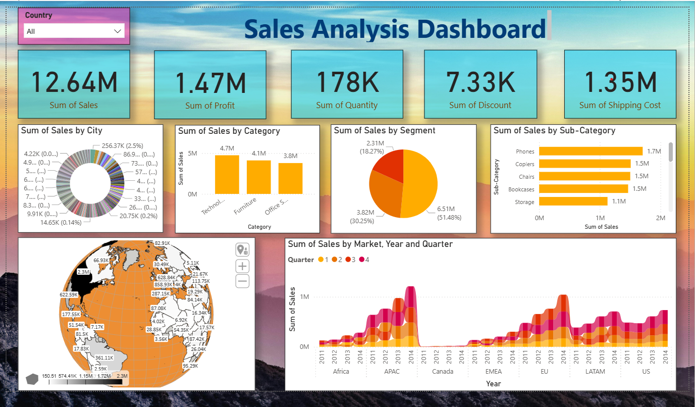
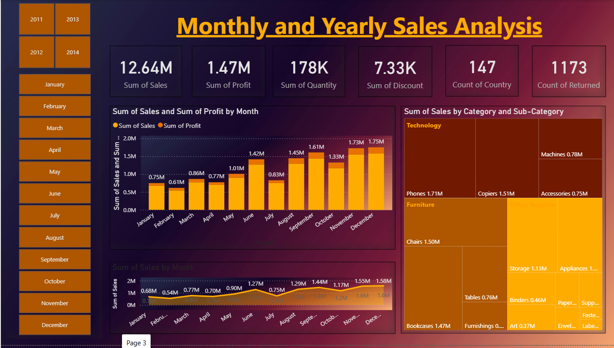

# 📊 Sales Analysis Dashboard — Power BI

An end-to-end **Power BI dashboard** analyzing global sales performance using the *Global Superstore* dataset. The dashboard provides interactive, drill-down insights into regional revenue trends, product-level profitability, shipping efficiency, and key performance indicators (KPIs) to support data-driven business decisions.

---

## 🖥️ Dashboard Preview

| Overview | Monthly and Yearly Sales |
|----------|------------|
|  |  |


## 🎯 Key Features

- **Revenue KPIs** — Total Sales (12.64M), Total Profit (1.47M), Quantity (178K), Total Discount (7.33K), and Shipping Cost (1.35M) at a glance
- **Geographic Analysis** — Interactive globe map showing sales distribution across countries worldwide
- **City-Level Breakdown** — Donut chart highlighting sales contribution by top cities
- **Product Performance** — Sales by Category (Technology, Furniture, Office Supplies) and top Sub-Categories (Phones, Copiers, Chairs, Bookcases, Storage)
- **Market & Quarterly Trends** — Stacked area chart showing sales by Market (Africa, APAC, Canada, EMEA, EU, LATAM, US) across Years and Quarters
- **Monthly & Yearly Analysis** — Dedicated page with month-over-month sales and profit trends, year/month slicers, and category treemap
- **Customer Segments** — Revenue distribution across Consumer (51.48%), Corporate (30.25%), and Home Office (18.27%) segments
- **Interactive Filtering** — Country slicer for dynamic filtering, plus Year and Month slicers on the detailed analysis page
- **Multi-Page Dashboard** — Overview page for high-level insights and a detailed Monthly & Yearly Sales Analysis page

---

## 📁 Repository Structure

```
Sales-Analysis-Dashboard/
│
├── Global Superstore.xls      # Source dataset (Global Superstore)
├── sales_analysis.pbix         # Power BI dashboard file
├── screenshots/                # Dashboard screenshots for README
│   ├── sales_overview.png
│   └── monthly_yearly_sales.png
├── .gitignore                  # Git ignore rules
└── README.md                   # Project documentation
```

---

## 📊 Dataset

**Source:** Global Superstore dataset  
**Format:** Excel (`.xls`)  
**Records:** ~51,000+ orders across 147 countries

| Column | Description |
|--------|-------------|
| `Order ID` | Unique identifier for each order |
| `Order Date` | Date the order was placed |
| `Ship Date` | Date the order was shipped |
| `Ship Mode` | Shipping method (Standard, Second Class, First Class, Same Day) |
| `Customer Name` | Name of the customer |
| `Segment` | Customer segment (Consumer, Corporate, Home Office) |
| `Country` | Customer's country |
| `Market` | Global market region |
| `Region` | Sub-region within the market |
| `Product Name` | Name of the product |
| `Category` | Product category (Furniture, Office Supplies, Technology) |
| `Sub-Category` | Product sub-category |
| `Sales` | Revenue from the order |
| `Quantity` | Number of units ordered |
| `Discount` | Discount applied to the order |
| `Profit` | Profit earned from the order |
| `Shipping Cost` | Cost of shipping |

---

## 🛠️ Tools & Technologies

| Tool | Purpose |
|------|---------|
| **Power BI Desktop** | Dashboard design, data modeling & visualization |
| **DAX** | Calculated measures, KPIs & time intelligence |
| **Power Query (M)** | Data cleaning, transformation & ETL |
| **Excel** | Source data format |

---

## 🚀 Getting Started

### Prerequisites

- [Power BI Desktop](https://powerbi.microsoft.com/desktop/) (free download from Microsoft)

### Steps to Open

1. **Clone the repository:**
   ```bash
   git clone https://github.com/Yash-lab01/Sales-Analysis-Dashboard.git
   ```
2. **Open the dashboard:**
   - Launch **Power BI Desktop**
   - Open `sales_analysis.pbix`
3. **Refresh data (if needed):**
   - Go to **Home → Transform Data → Data Source Settings**
   - Update the file path to point to your local `Global Superstore.xls` file
   - Click **Refresh**

---

---

## 📌 Key Insights

- 📈 **Technology** is the highest revenue-generating category at **4.7M**, followed by Furniture (4.1M) and Office Supplies (3.8M)
- 📱 **Phones** lead sub-category sales at **1.7M**, followed by Copiers (1.5M) and Chairs (1.5M)
- 👥 **Consumer** segment dominates with **51.48%** of total sales (6.51M), followed by Corporate (30.25%) and Home Office (18.27%)
- 🌍 **APAC** is the top-performing market, with noticeable quarterly spikes in Q4
- 📅 **November & December** consistently show the highest monthly sales (1.73M and 1.75M respectively)
- 📊 Sales show a clear **upward trend** from 2011 to 2014 across all markets
- 🔄 **1,173 returned orders** out of 178K total — a return rate worth monitoring
- 🌐 Sales span across **147 countries**, with major concentration in US, APAC, and EU regions

---

## 👤 Author

**Yash Bhawar**  
AI/ML Engineer & Data Analyst

[](https://github.com/Yash-lab01)
[](https://linkedin.com/in/yashbhawar)

---

## 📄 License

This project is open source and available under the [MIT License](LICENSE).

---

<p align="center">
  <i>If you found this project useful, consider giving it a ⭐!</i>
</p>
